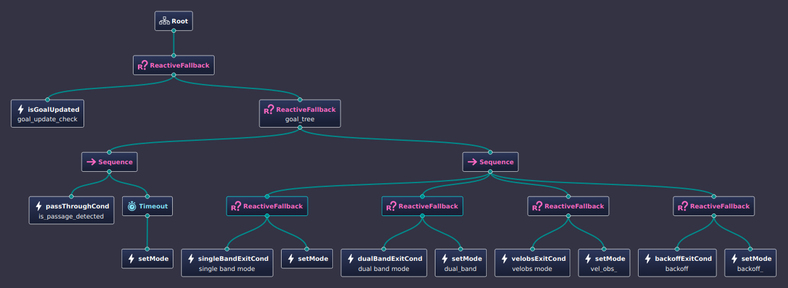

Mode Switching and Behavior Trees
=================================

In this section, we will explain how we switch between different modes using Behavior Trees (BTs). CoHAN2.0 integrates BTs to switch between different planning modalities and facilitate more modular architecture. You can add new or remove existing modalities by using an xml file.

CoHAN2.0 Behavior Tree
----------------------

The BT that integrates all modalities in CoHAN2.0 is shown below.

.. raw:: html

    

The BT looks for a goal update and as soon as it receives a new goal, it starts ticking the right branch to switch between different modes based on the conditions. At each instance, it looks for a passage detection and if a passage is detected, it activates the PassThrough mode for the given timeout (configurable). If no passage is detected or the PassThrough is done, it switches to the cycling mode sequence used by CoHAN  (refer to paper for details on different modes). The switch from one mode to another happens when an exit condition is met.

The default xml used by CoHAN2.0 is shown below:

.. code-block:: xml

    <root BTCPP_format="4" >
        <BehaviorTree ID="MainTree">
            <ReactiveFallback>
                <!-- Condition -->
                <isGoalUpdated name="goal_update_check" goal_update="{goal_update}" recovery="{recovery}"/>
                <ReactiveFallback name="goal_tree">
                    <!-- First Control -->
                    <Sequence>
                        <passThroughCond name="is_passage_detected" passage_type="{passage_type}"/>
                        <Timeout msec="5000">
                            <setMode plan_type="passthrough" predict_type="const_vel" mode="{planning_mode}"/>
                        </Timeout>
                    </Sequence>
                    <!-- Second Control -->
                    <Sequence>
                        <ReactiveFallback>
                            <singleBandExitCond name="single band mode" agents_info="{agents_info}" dist_max="10"/>
                            <setMode plan_type="single" predict_type="const_vel" mode="{planning_mode}"/>
                        </ReactiveFallback>
                        <ReactiveFallback>
                            <dualBandExitCond name="dual band mode" agents_info="{agents_info}" dist_threshold="2.5" nav_goal="{nav_goal}"/>
                            <setMode name="dual_band" plan_type="dual" predict_type="behind" mode="{planning_mode}"/>
                        </ReactiveFallback>
                        <ReactiveFallback>
                            <velobsExitCond name="velobs mode" agents_info="{agents_info}" agents_ptr="{agents_ptr}" stuck_agent="{stuck_agent}"/>
                            <setMode name="vel_obs_" plan_type="velobs" predict_type="const_vel" mode="{planning_mode}"/>
                        </ReactiveFallback>
                        <ReactiveFallback>
                            <backoffExitCond name="backoff" agents_info="{agents_info}" backoff_ptr="{backoff_ptr}" recovery="{recovery}" nav_goal="{nav_goal}" agents_ptr="{agents_ptr}"/>
                            <setMode name="backoff_" plan_type="backoff" predict_type="predict" mode="{planning_mode}"/>
                        </ReactiveFallback>
                    </Sequence>
                </ReactiveFallback>
            </ReactiveFallback>
        </BehaviorTree>
    </root>

These modes can be configured as needed and you can even add new modalities to CoHAN2.0 depending on your use case. Please have a look at code API for details on implementation.

